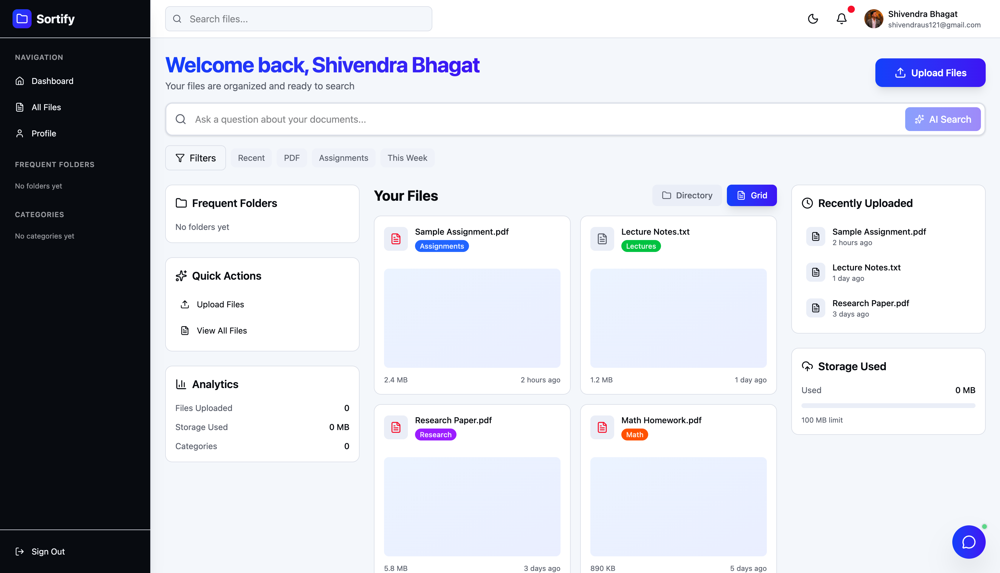
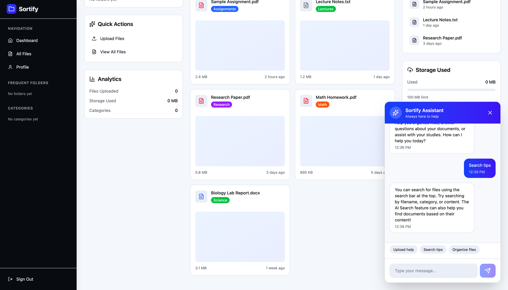

# Sortify 🧠

**An AI-powered document organization and retrieval platform for students**  
Built with **React, FastAPI, PostgreSQL, and PGVector**, Sortify intelligently categorizes uploaded files, stores their embeddings, and enables **semantic search** through a **Retrieval-Augmented Generation (RAG)** pipeline.

---

## 🚀 Overview

Sortify transforms the way students manage their academic files.  
Simply upload your PDFs, notes, or assignments — Sortify automatically categorizes, embeds, and stores them for quick retrieval.  
With the integrated AI assistant, you can query your files in natural language and instantly get context-aware answers.

---

### Login Page

### Dashboard View

### Sortify Assistant

---

## 🧩 Tech Stack

| Layer | Technologies |
|:------|:--------------|
| **Frontend** | React, TypeScript, Vite, TailwindCSS |
| **Backend** | Python, FastAPI |
| **Database** | PostgreSQL with PGVector extension |
| **AI / ML** | RAG (Retrieval-Augmented Generation), Embeddings, Vector Similarity Search |
| **Infrastructure** | Supabase, Node.js, npm, Vite Dev Server |
| **Version Control** | Git + GitHub |

---

## 🧠 Key Features

- **Automated Categorization:**  
  Sortify classifies uploaded academic documents (e.g., assignments, lecture notes, research papers) into relevant folders automatically.

- **AI-Powered Search (RAG):**  
  Retrieve specific information from stored documents using semantic search powered by vector embeddings and RAG.

- **Document Chunking & Embedding:**  
  Uploaded files are tokenized into chunks, converted into embeddings, and stored in PGVector for high-precision context retrieval.

- **Chat-Based Interface:**  
  Interact with your data through a chatbot integrated with the RAG pipeline — ask questions about your uploaded files and get contextual answers.

- **FastAPI + PostgreSQL Integration:**  
  Efficient API architecture that handles file uploads, embedding generation, and vector similarity queries.

- **Responsive UI:**  
  A modern, minimal interface built with React, Tailwind, and Vite — designed for productivity and clarity.

---

## System Architecture

Frontend (React) --> FastAPI Backend --> PostgreSQL (PGVector)

↑ ↓

User Uploads Embeddings / Chunking

↑ ↓

RAG Query <------ Vector Retrieval + LLM Response

---

## 💡 Future Enhancements

Google Drive & Canvas integration for auto-sync

Multi-user collaboration with shared folders

Fine-tuned local LLM for faster retrieval

Inline document preview & annotation system